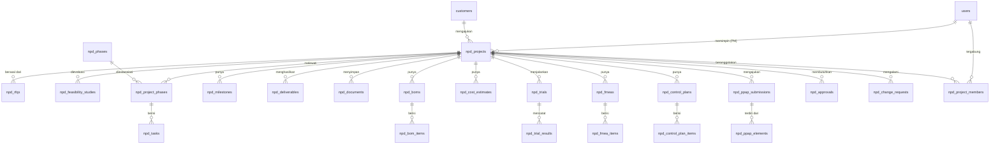

# PRD - Modul New Product Development (NPD)

**Perusahaan:** PT Fusoh Tube Part Indonesia (FTPI)
**Sistem:** Modul NPD pada ERP internal (Laravel / Livewire / MySQL / Tailwind)
**Versi Dokumen:** 1.0 (Draft)
**Status:** Untuk direview

---

## 1. Ringkasan

Modul NPD adalah modul ERP yang mengelola siklus hidup pengembangan produk baru, mulai dari inquiry/RFQ pelanggan sampai produk siap masuk mass production. Modul ini menstrukturkan proses menjadi 5 fase stage-gate mengikuti kerangka APQP (Advanced Product Quality Planning) dan diakhiri dengan submission PPAP (Production Part Approval Process), sesuai praktik standar industri otomotif dan IATF 16949.

Untuk FTPI (manufaktur tube part), modul ini menjadi pusat kendali proyek pengembangan part baru: satu tempat untuk menyimpan drawing, spesifikasi, hasil trial, FMEA, control plan, costing, dan approval, menggantikan pengelolaan yang tersebar di Excel dan email.

## 2. Latar Belakang dan Tujuan

### Masalah saat ini (asumsi umum, mohon dikoreksi jika berbeda)
- Data proyek NPD tersebar di banyak file Excel dan folder shared.
- Status proyek tidak terlihat real-time; sulit tahu proyek ada di fase mana.
- Dokumen APQP/PPAP dibuat manual dan tidak terhubung ke data trial/inspeksi.
- Approval gate antar-fase tidak terekam rapi dan tidak ada jejak audit.

### Tujuan modul
1. Menstandarkan alur NPD ke dalam 5 fase APQP dengan gate approval di setiap fase.
2. Memberikan visibilitas status proyek secara real-time bagi manajemen dan tim lintas fungsi.
3. Menyimpan seluruh deliverable (drawing, DFMEA, PFMEA, control plan, MSA, PPAP) terpusat dengan kontrol revisi.
4. Menghubungkan hasil trial dan inspeksi langsung ke dokumen kualitas dan keputusan gate.
5. Menyediakan jejak audit approval untuk kebutuhan IATF 16949 dan audit pelanggan.

### Sasaran terukur (contoh, sesuaikan target)
- Waktu siklus NPD (RFQ sampai PPAP approved) turun minimal 15 persen.
- 100 persen proyek baru dikelola di modul (tidak ada lagi tracking Excel paralel).
- Kelengkapan dokumen PPAP tercek otomatis sebelum submission.

## 3. Ruang Lingkup

### Termasuk (In-Scope)
- Intake RFQ/inquiry dan studi feasibility.
- Manajemen proyek NPD dengan struktur 5 fase APQP.
- Task dan milestone per fase, beserta PIC dan timeline.
- Manajemen dokumen dengan versi dan revisi.
- Preliminary BOM dan estimasi biaya (costing).
- Trial/prototype dan pencatatan hasil inspeksi/pengukuran.
- DFMEA dan PFMEA.
- Control Plan.
- PPAP submission beserta checklist elemen PPAP.
- Workflow approval gate antar-fase.
- Engineering Change Request (ECR/ECN) selama proyek berjalan.
- Dashboard dan pelaporan status.

### Tidak Termasuk (Out-of-Scope) - fase awal
- Modul mass production / production scheduling (hanya handover, bukan eksekusi).
- Modul procurement/PO penuh (hanya referensi supplier dan estimasi biaya).
- Integrasi CAD/PLM otomatis (fase awal cukup upload drawing manual).
- SPC real-time dari mesin (fase awal input manual, integrasi MES menyusul).

## 4. Referensi Standar

| Kerangka | Peran di modul |
|---|---|
| APQP (5 fase) | Struktur stage-gate proyek NPD |
| PPAP | Paket persetujuan produksi ke pelanggan (gate akhir) |
| DFMEA / PFMEA | Analisis risiko desain dan proses |
| Control Plan | Rencana pengendalian karakteristik proses |
| MSA / SPC | Validasi sistem pengukuran dan kapabilitas proses |
| IATF 16949 | Kepatuhan sistem mutu otomotif |

### Pemetaan 5 Fase APQP ke modul

1. **Fase 1 - Plan and Define:** intake RFQ, review kebutuhan pelanggan, feasibility study, penetapan tim dan target, preliminary BOM.
2. **Fase 2 - Product Design and Development:** DFMEA, design review, prototype, gambar/spesifikasi rilis.
3. **Fase 3 - Process Design and Development:** process flow, PFMEA, control plan, rencana MSA, layout proses.
4. **Fase 4 - Product and Process Validation:** trial produksi, studi kapabilitas proses, MSA, submission PPAP.
5. **Fase 5 - Feedback and Corrective Action:** handover ke mass production, monitoring awal, tindakan perbaikan.

## 5. Peran Pengguna (User Roles)

| Peran | Hak akses utama |
|---|---|
| Project Manager NPD | Membuat proyek, menetapkan tim, mengelola timeline, mengajukan gate |
| Design Engineer | Mengelola drawing, DFMEA, BOM, prototype |
| Process Engineer | Mengelola process flow, PFMEA, control plan, trial |
| Quality Engineer | Inspeksi hasil trial, MSA, menyusun paket PPAP |
| Procurement | Input supplier, estimasi biaya material |
| Costing/Finance | Review dan approve estimasi biaya dan quotation |
| Manager/Approver | Menyetujui atau menolak gate dan dokumen |
| Admin/IT | Master data, manajemen user, konfigurasi workflow |
| Viewer | Akses baca dashboard dan status |

Akses diatur berbasis peran (RBAC). Sejalan dengan Active Directory FTPI, autentikasi dapat memakai akun domain yang sudah ada.

## 6. Alur Proses (Stage-Gate)

```
RFQ/Inquiry
   |
   v
[Feasibility Study] --(No-Go)--> Tutup proyek
   |
   v (Go)
Fase 1 Plan & Define  --[GATE 1]-->
   |
   v
Fase 2 Product Design --[GATE 2]-->
   |
   v
Fase 3 Process Design --[GATE 3]-->
   |
   v
Fase 4 Validation & PPAP --[GATE 4 / PPAP Approved]-->
   |
   v
Fase 5 Handover ke Mass Production --[Project Close]
```

Setiap GATE membutuhkan approval dari approver yang ditunjuk. Proyek tidak dapat lanjut ke fase berikutnya sebelum gate sebelumnya disetujui. Setiap keputusan gate (approve/reject/hold) terekam dengan approver, tanggal, dan komentar.

## 7. Kebutuhan Fungsional

### 7.1 Manajemen RFQ dan Feasibility
- FR-01: Sistem dapat mencatat RFQ dari pelanggan (nomor RFQ, drawing ref, qty, target harga, due date).
- FR-02: Sistem dapat membuat feasibility study dengan kesimpulan Go / No-Go / Conditional.
- FR-03: RFQ yang disetujui otomatis membentuk proyek NPD baru dengan kode proyek unik.

### 7.2 Manajemen Proyek dan Fase
- FR-04: Setiap proyek memiliki kode, pelanggan, part number, tipe proyek (baru/modifikasi/derivatif), target SOP, dan project manager.
- FR-05: Sistem melacak proyek melalui 5 fase APQP dengan status per fase (planned/in_progress/done).
- FR-06: Sistem mendukung task per fase dengan PIC, timeline rencana vs aktual, progress, dan dependensi antar-task.
- FR-07: Sistem mencatat milestone kunci dengan tanggal rencana dan aktual.

### 7.3 Manajemen Dokumen
- FR-08: Upload dokumen (drawing, spesifikasi, laporan) yang terhubung ke proyek atau entitas terkait.
- FR-09: Kontrol versi dan revisi dokumen; revisi lama tetap tersimpan.
- FR-10: Setiap deliverable APQP wajib punya status (belum/dalam proses/selesai) dan penanggung jawab.

### 7.4 BOM dan Costing
- FR-11: Membuat preliminary BOM dengan item, material, qty, UOM, dan supplier.
- FR-12: Membuat estimasi biaya (material, proses, tooling, overhead, margin) dan quotation.
- FR-13: Costing memerlukan approval sebelum quotation dikirim ke pelanggan.

### 7.5 Trial, Inspeksi, dan Kualitas
- FR-14: Mencatat trial/prototype (nomor trial, tipe, tanggal, qty rencana/aktual, OK/NG).
- FR-15: Mencatat hasil inspeksi/pengukuran per karakteristik (nominal, toleransi, hasil ukur, judgement).
- FR-16: Membuat DFMEA dan PFMEA dengan perhitungan RPN (Severity x Occurrence x Detection) dan tindakan perbaikan.
- FR-17: Membuat Control Plan berisi proses, karakteristik, metode ukur, sample size, frekuensi, dan reaction plan.

### 7.6 PPAP
- FR-18: Membuat PPAP submission dengan level PPAP (1 sampai 5) dan nomor PSW.
- FR-19: Checklist 18 elemen PPAP; tiap elemen punya status dan dokumen pendukung.
- FR-20: Sistem memblokir submission jika elemen wajib belum lengkap.
- FR-21: Mencatat status persetujuan PPAP dari pelanggan (submitted/interim/approved/rejected).

### 7.7 Approval Gate dan Change Request
- FR-22: Workflow approval per gate fase, mendukung multi-level approver.
- FR-23: Proyek tidak dapat naik fase sebelum gate disetujui.
- FR-24: Mencatat Engineering Change Request (ECR/ECN) selama proyek dengan alasan, dampak, dan approval.
- FR-25: Semua keputusan approval tersimpan sebagai jejak audit.

### 7.8 Dashboard dan Laporan
- FR-26: Dashboard status seluruh proyek (funnel per fase, proyek terlambat, gate pending).
- FR-27: Laporan lead time NPD per proyek dan agregat.
- FR-28: Notifikasi task jatuh tempo dan gate menunggu approval.

## 8. Kebutuhan Non-Fungsional

- NFR-01 Teknologi: Laravel + Livewire + MySQL + Tailwind, konsisten dengan aplikasi internal FTPI lain.
- NFR-02 Autentikasi: integrasi Active Directory (ftpi.local) / SSO domain bila memungkinkan.
- NFR-03 Otorisasi: RBAC berbasis peran pada seluruh aksi.
- NFR-04 Audit trail: seluruh perubahan status dan approval tercatat (user, waktu, aksi).
- NFR-05 Multi-bahasa: label UI mendukung Indonesia dan Inggris (opsional Jepang) untuk lingkungan kerja FTPI.
- NFR-06 Penyimpanan file: dokumen disimpan di storage terkontrol (mis. SharePoint/Microsoft 365 atau storage internal) dengan referensi path di database.
- NFR-07 Kinerja: daftar proyek dan dashboard tampil di bawah 2 detik untuk skala data FTPI.
- NFR-08 Backup: mengikuti kebijakan backup server FTPI yang berlaku.

## 9. Integrasi dengan Modul ERP Lain

| Modul | Arah integrasi |
|---|---|
| Master Customer | NPD mereferensikan data pelanggan |
| Master Product/Item | Saat proyek selesai, part baru didaftarkan ke master produk |
| BOM Produksi | Preliminary BOM menjadi dasar BOM produksi final |
| Procurement/Supplier | Referensi supplier untuk BOM dan costing |
| Quality/QMS | Control plan dan hasil inspeksi menjadi baseline QC produksi |
| Production | Handover proyek approved untuk mass production |

## 10. Model Data (ERD)

Detail ERD tersedia pada file terpisah `ERD_Modul_NPD_FTPI.mermaid`. Ringkasan entitas inti:

- `customers` - pelanggan sumber RFQ.
- `npd_projects` - header proyek NPD.
- `npd_rfqs` - RFQ/inquiry masuk.
- `npd_feasibility_studies` - studi kelayakan.
- `npd_phases` - master 5 fase APQP.
- `npd_project_phases` - progres proyek per fase.
- `npd_tasks` - task per fase.
- `npd_milestones` - milestone kunci.
- `npd_deliverables` - deliverable APQP per fase.
- `npd_documents` - dokumen dengan versi/revisi.
- `npd_boms` dan `npd_bom_items` - preliminary BOM.
- `npd_cost_estimates` - estimasi biaya dan quotation.
- `npd_trials` dan `npd_trial_results` - trial dan hasil inspeksi.
- `npd_fmeas` dan `npd_fmea_items` - DFMEA/PFMEA.
- `npd_control_plans` dan `npd_control_plan_items` - control plan.
- `npd_ppap_submissions` dan `npd_ppap_elements` - PPAP.
- `npd_approvals` - workflow approval gate.
- `npd_change_requests` - ECR/ECN.
- `npd_project_members` - anggota tim proyek.
- `users` - pengguna sistem.



## 11. Metrik Keberhasilan (KPI)

- Lead time NPD rata-rata (RFQ sampai PPAP approved).
- Persentase proyek on-time terhadap target SOP.
- Jumlah gate reject dan alasan (untuk perbaikan proses).
- Kelengkapan dokumen PPAP saat submission.
- Adopsi: persentase proyek baru yang dikelola di modul.

## 12. Asumsi dan Batasan

- Modul mengasumsikan FTPI mengikuti pola APQP/PPAP otomotif. Jika sebagian pelanggan non-otomotif, alur gate dapat disederhanakan per tipe proyek.
- Fase awal input SPC/MSA dilakukan manual; integrasi mesin/MES menyusul.
- Penyimpanan file mengikuti infrastruktur Microsoft 365/SharePoint FTPI yang sudah ada.
- Angka target pada bagian sasaran adalah placeholder dan perlu disepakati dengan manajemen.

## 13. Saran Tahap Implementasi

1. **Tahap 1 (MVP):** proyek, 5 fase, task, dokumen, approval gate, dashboard.
2. **Tahap 2:** BOM, costing, trial, hasil inspeksi.
3. **Tahap 3:** DFMEA, PFMEA, control plan.
4. **Tahap 4:** PPAP submission dan checklist elemen, ECR/ECN.
5. **Tahap 5:** integrasi master produk, handover produksi, notifikasi lanjutan.
